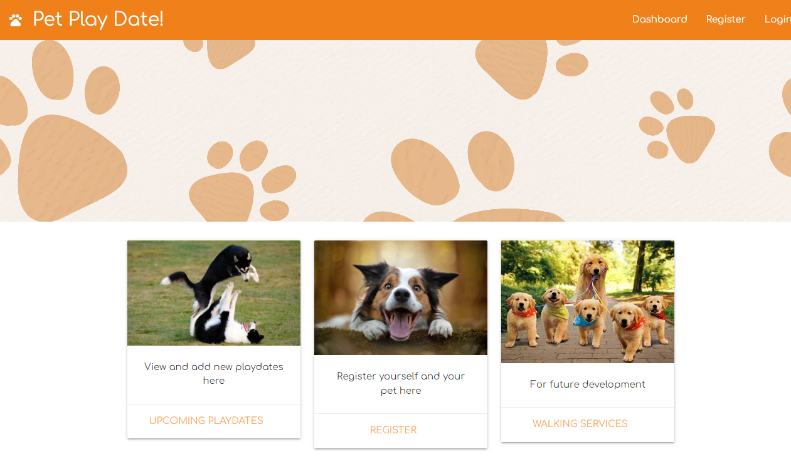
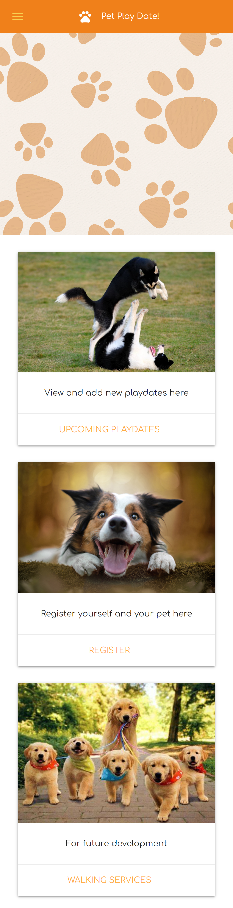
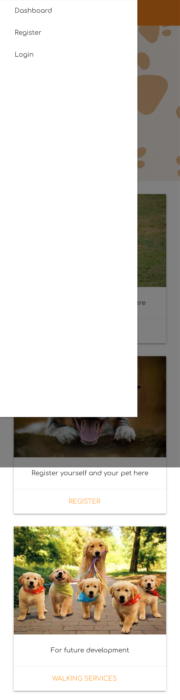

# Pet Playdate!

## Description

The motivation and purpose behind this project was to create an app that can be used to register and keep track of playdates. The app allows users to create an account, or login with existing credentials. Once logged in, the user can register new pets and use their profile to create playdate events with other pet owners in their area.

It solves the issue of not having an app that can keep track of upcoming playdates. We learned a lot about linking the front end development to back end, as well as using a new styling framework.

## Table of Contents

- [Installation](#installation)
-[Technologies](#technologies)
- [Usage](#usage)
- [Credits](#credits)
- [License](#license)
- [Features](#features)

## Installation

Nothing needs to be installed! Just head to the heroku link to get started!

## Technologies

* Handlebars-js
* Materialize CSS Framework
* bcrypt (encrypting user passwords)
* Sequelize-session (Keeping sessions open for users to be persistently logged in)
* MYSQL
*Sequelize (To build out models and handle MYSQL queries)
* Node
* Express
* Insomnia (To test API routes as we went)
* Cloudinary (To handle uploading of photos and cloud storage)

## Usage

Heroku deployment: [here](https://salty-sierra-16506.herokuapp.com/)
Upon entering the page, you are given the option to login (if you have an existing account) or register a pet. After the registration is complete, you'll immediately be taken to your dashboard where you will see a newly created profile for your pet and the ability to use a date picker to choose a play date and a location (Currently just in the Philadelphia area for v1.0. We intend to look into geolocation APIs in the future). If other users have signed up for a play date on the same date, you'll be able to see their profiles under the new event details.

Desktop/tablet view:

Mobile view:

## Credits

Leon F. [https://github.com/hope428](https://github.com/hope428)

Brian C. [https://github.com/BrianSChapman](https://github.com/BrianSChapman)

Morgan D. [https://github.com/M-Dickerson](https://github.com/M-Dickerson)

## License

MIT License

A short and simple permissive license with conditions only requiring preservation of copyright and license notices. Licensed works, modifications, and larger works may be distributed under different terms and without source code.

## Features

- Login and signout features. Once your account is created, all your data gets saved to your profile!
- A hamburger menu displays in the navbar for easy page switching
- A dashboard complete with upcoming events, a small biography of your registered pets, and an area to create new playdate events!
